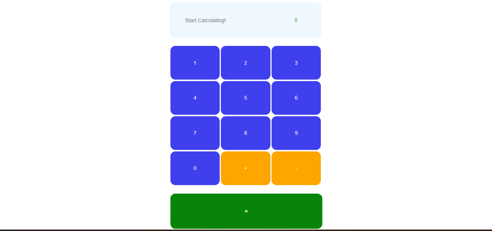

#  Calculator App

A calculator web application that offers   basic arithmetic operations . Built using modern web technologies (HTML, CSS, JavaScript), this app is responsive and easy to use on any device.

## Features:
- Basic arithmetic (addition, subtraction, )
- Advanced functions (square root, exponentiation, trigonometry)
- Clear, intuitive UI with a responsive layout

## Installation:
1. Clone the repository
2. Open `index.html` in your preferred web browser

